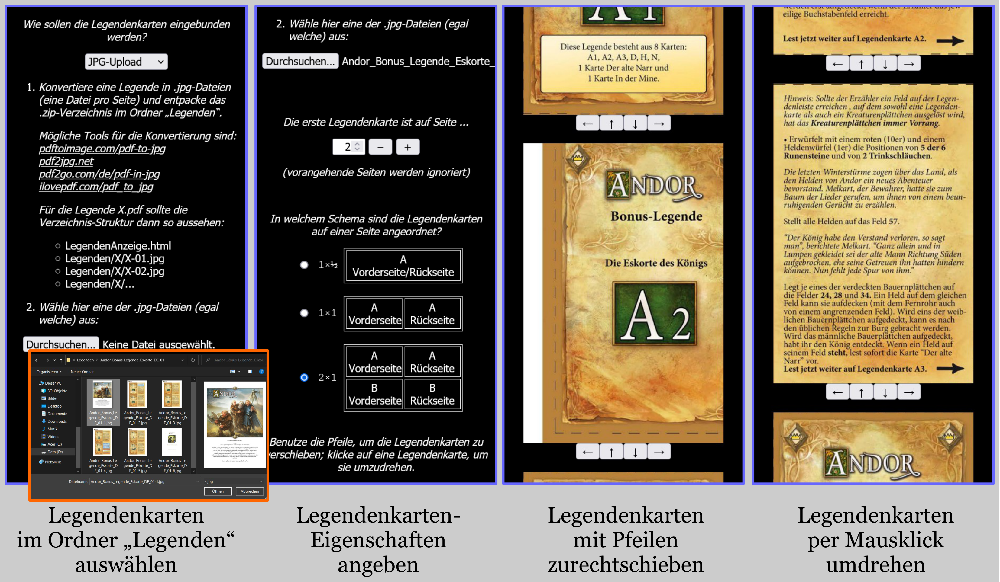

# Legenden-Anzeige

Tool zum Anzeigen von Bonus- und Fan-Legenden der Spielereihe [*Legenden von Andor*](https://legenden-von-andor.de/)\* auf dem Smartphone oder Computer.

	 
	Die im Bild gezeigte Bonus-Legende <i>Die Eskorte des Königs</i> kann hier heruntergeladen werden: 
  <a href="https://legenden-von-andor.de/bonus-legende-die-eskorte-des-koenigs/">https://legenden-von-andor.de/bonus-legende-die-eskorte-des-koenigs/</a>

\*Diese Spielhilfe ist ein Fan-Projekt und steht in keinerlei Verbindung zu den Machern der Andor-Spielereihe.

**Download:** Der Ordner `LegendenAnzeige` kann über [Code] → [Download ZIP] heruntergeladen werden.

**Benutzung:** Der ZIP-Ordner muss entpackt und auf dem entsprechenden Gerät gespeichert werden. Die Legenden-Anzeige kann dann einfach in einem Web-Browser (z. B. *Google Chrome*) geöffnet werden, indem man in die URL-Zeile den Pfad zur Datei `LegendenAnzeige.html` eingibt:

- bei Windows: `file:///C:/.../LegendenAnzeige/LegendenAnzeige.html`
- bei Android: `file:///sdcard/.../LegendenAnzeige/LegendenAnzeige.html`

(Wobei die Punkte durch den genauen Pfad zum Speicherort ersetzt werden müssen und auch der Anfang je nach Gerät variieren kann.) Die Legendenkarten, die angezeigt werden sollen, müssen im Ordner `Legenden` gespeichert werden. Genauere Anweisungen werden in der Legenden-Anzeige angezeigt.

**Bildquellen:** Sofern eine Internetverbindung besteht, wird zusätzlich zu den Legendenkarten auch die Checkliste angezeigt. Die Bilder werden dabei direkt aus diesen Quellen verlinkt:
- Vorderseite
	- Webseite: [https://www.poeppelkiste.de/rezensionen/2012/andor/andor.php](https://www.poeppelkiste.de/rezensionen/2012/andor/andor.php)
	- Bild: [https://www.poeppelkiste.de/rezensionen/2012/andor/liste.gif](https://www.poeppelkiste.de/rezensionen/2012/andor/liste.gif)
- Rückseite
	- Webseite: [https://legenden-von-andor.de/forum/viewtopic.php?f=9&t=2316&p=34270](https://legenden-von-andor.de/forum/viewtopic.php?f=9&t=2316&p=34270)
	- Bild: [https://legenden-von-andor.de/forum/download/file.php?id=798&sid=4eb4246852856b032ff1ac1cd2c933f3&mode=view](https://legenden-von-andor.de/forum/download/file.php?id=798&sid=4eb4246852856b032ff1ac1cd2c933f3&mode=view)
